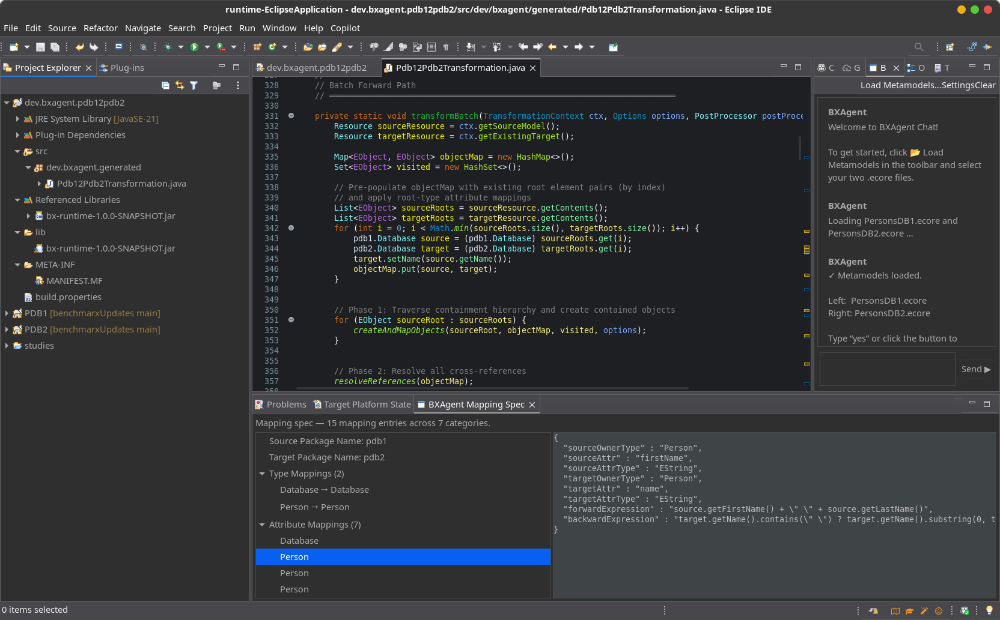

# BXAgent4Eclipse

BXAgent4Eclipse is an Eclipse plug-in that adds a Copilot-style chat view for model-transformation workflows.
It guides users through loading two `.ecore` metamodels, extracting a mapping with an LLM, generating a Java transformation class, and validating compilation.

## What this project contains

- An Eclipse view: **BXAgent Chat**
- A command/shortcut to open the view (`Ctrl+Shift+B`)
- A preference page for LLM and generation settings
- The conversation/controller flow for the BXAgent pipeline in Eclipse

## Prerequisites

- Eclipse IDE with Plug-in Development Environment (PDE)
- Java 21

## How to use

1. Import/open the `dev.bxagent.eclipse` plug-in project in Eclipse.
2. Start an Eclipse Application launch (runtime workbench) for plug-in testing.
3. Open **BXAgent Chat** (via command or `Ctrl+Shift+B`).
4. Click **Load Metamodels…** and select the two `.ecore` files.
5. Continue in chat (or inline buttons) through:
   - **Extract Mapping**
   - **Generate Code**
   - **Validate (Compile)**
6. Configure LLM provider/model/keys in **Preferences → BXAgent** when needed.

## Current status

The UI flow is implemented. The service backend is currently wired to a stub (`StubBXAgentService`), so full end-to-end generation depends on integrating the real BXAgent service JARs.
